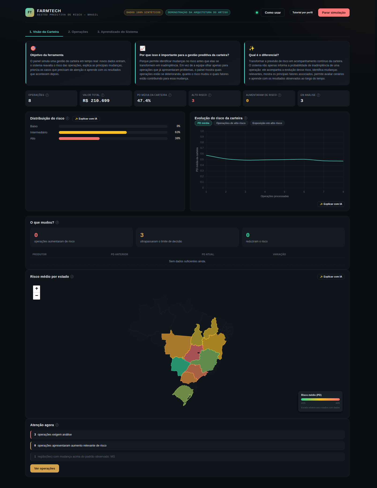
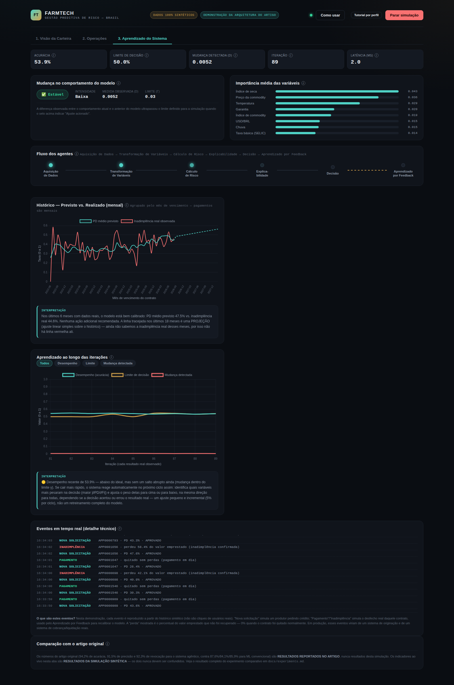
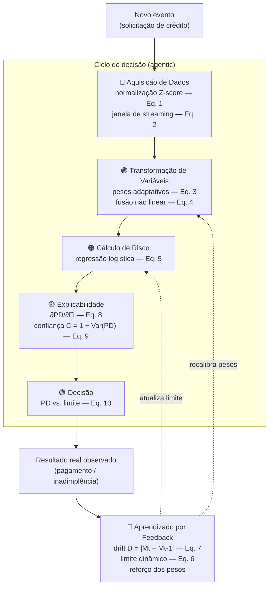

# FarmTech — Gestão Preditiva de Risco de Crédito Agropecuário

> Réplica arquitetural funcional do artigo **"Agentic AI for Autonomous, Explainable, and
> Real-Time Credit Risk Decision-Making"** (Kubam, C. S., 2024, *IJISAE* 12(23s)), adaptada
> ao crédito agropecuário brasileiro e executada sobre dados 100% sintéticos.

[]()
[]()
[]()
[]()
[]()

---

## Sumário

- [O que é este projeto](#o-que-é-este-projeto)
- [Screenshots](#screenshots)
- [Arquitetura](#arquitetura)
- [O que cada agente faz](#o-que-cada-agente-faz)
- [Diferencial em relação a um framework de ML comum](#diferencial-em-relação-a-um-framework-de-ml-comum)
- [Rodando localmente](#rodando-localmente)
- [Deploy no Render.com](#deploy-no-rendercom)
- [Estrutura do projeto](#estrutura-do-projeto)
- [Testes](#testes)
- [Experimento comparativo](#experimento-comparativo)
- [Transparência científica](#transparência-científica)
- [Limitações conhecidas](#limitações-conhecidas)
- [Referência](#referência)

---

## O que é este projeto

O painel simula uma **gestão de carteira de crédito em tempo real**: novos
dados entram, o sistema reavalia o risco das operações, explica as principais mudanças,
prioriza os casos que precisam de atenção e aprende com os resultados que acontecem depois.

É uma **demonstração funcional de uma arquitetura** que na prática, é uma estrutura que conecta dados, modelos de risco e processos de decisão em um ciclo contínuo. Ela mostra como os dados entram, o risco é recalculado, as mudanças são explicadas, os casos são priorizados e os resultados posteriores alimentam o aprendizado contínuo por reforço.

**Por que isso importa para gestão preditiva de carteira:** permite identificar mudanças no
risco *antes* que elas virem inadimplência. Em vez de olhar só para operações que já deram
problema, o painel mostra quais operações estão se deteriorando, quanto o risco mudou e
quais fatores estão por trás dessa mudança; com a decisão, a explicação e o reaprendizado
acontecendo no mesmo ciclo, não em processos separados.

## Screenshots

<table>
<tr><td></td>
<td></td></tr>
<tr><td align="center"><sub>Aba 1 — Visão da Carteira</sub></td>
<td align="center"><sub>Aba 3 — Aprendizado do Sistema</sub></td></tr>
</table>

## Arquitetura



O núcleo matemático (Equações 1–10) roda em **Python puro, sem scikit-learn** — regressão
logística treinada por gradiente descendente local, determinística sob seed fixa (42).
O front-end (`frontend/`) é **vanilla JS + Chart.js + Leaflet**, sem framework — as libs são
vendorizadas localmente (`frontend/vendor/`), sem dependência de CDN externo.

## O que cada agente faz

| Agente | Responsabilidade | Equação(ões) |
|---|---|---|
| **Aquisição de Dados** | Recebe o evento bruto, valida campos obrigatórios, aplica normalização Z-score e atualiza a janela de streaming. | Eq. 1, 2 |
| **Transformação de Variáveis** | Aplica pesos adaptativos a cada variável e calcula a fusão não linear entre elas. | Eq. 3, 4 |
| **Cálculo de Risco** | Regressão logística calcula a Probabilidade de Inadimplência (PD) sobre as variáveis ponderadas. | Eq. 5 |
| **Explicabilidade** | Calcula a contribuição de cada variável (derivada parcial ∂PD/∂Fi) e a confiança da previsão — **no momento da decisão**, não depois (não é SHAP/LIME pós-hoc). | Eq. 8, 9 |
| **Decisão** | Compara PD com o limite de decisão dinâmico e decide: Aprovado / Em análise / Recusado. | Eq. 10 |
| **Aprendizado por Feedback** | Quando o resultado real é observado: calcula a perda, mede a mudança de comportamento (drift), atualiza o limite de decisão e — se o drift ultrapassa o limite γ — reforça os pesos das variáveis mais influentes na decisão. | Eq. 6, 7 |

## Diferencial em relação a um framework de ML comum

| | Pipeline de ML tradicional | Este projeto |
|---|---|---|
| **Fluxo** | `dados → modelo → previsão` (linear, termina na previsão) | `dados → transformação → risco → explicação → decisão → resultado real → aprendizado → novo ciclo` (**loop fechado**) |
| **Explicabilidade** | Post-hoc, geralmente separada do pipeline de decisão (SHAP/LIME rodados depois) | Calculada **dentro do próprio ciclo de decisão**, pela derivada analítica do modelo |
| **Adaptação** | Retreinamento manual/agendado (batch, semanas ou meses depois) | Camada de pesos adaptativos e limite de decisão que se ajusta **a cada resultado observado**, sem esperar um retreinamento completo |
| **Detecção de mudança** | Geralmente ausente ou externa ao pipeline (monitoramento à parte) | Nativa: `drift = |Mt − Mt-1|` calculado a cada ciclo, com ação automática quando ultrapassa o limite |
| **Auditoria de decisão individual** | Requer instrumentação extra | Cada operação carrega seu PD, limite, confiança e fatores no momento exato da decisão — auditável linha a linha |
| **Transparência de dados vs. modelo** | Raramente formalizada | Toda peça do sistema é classificada como `ARTICLE-SPECIFIED`, `IMPLEMENTATION CHOICE` ou `BRAZILIAN/AGRO ADAPTATION` (ver [Transparência científica](#transparência-científica)) |

O ganho não é "ter agentes" — é o **loop fechado de feedback**. O próprio experimento
comparativo deste repositório mostra isso: sem o loop de feedback, o wrapper agêntico
sozinho não supera um modelo estático (ver [Experimento comparativo](#experimento-comparativo)).

## Rodando localmente

```bash
git clone <url-do-seu-repo>
cd agentic-credit-agro
pip install -r requirements.txt --break-system-packages   # remova a flag se estiver em venv
python scripts/generate_synthetic_data.py --seed 42
python run.py
```

Abra `http://localhost:8000` e clique em **"Iniciar simulação"**.

> ⚠️ Use sempre `python run.py` ou `uvicorn backend.main:app --reload`. **Não** rode
> `uvicorn backend.api.routes:app` — esse módulo só expõe um `router`, não o `app` completo
> (com CORS e o front-end montado).

### Habilitando o resumo por IA (opcional)

```bash
cp .env.example .env
# edite .env e defina OPENAI_API_KEY=sk-...
python run.py
```

Sem a chave, o app funciona 100% normalmente — os botões "✨ Explicar com IA" apenas
respondem de forma transparente que o recurso está desativado.

## Deploy no Render.com

Este repositório inclui um [`render.yaml`](render.yaml) (Render Blueprint). Duas formas de usar:

### Opção A — Blueprint (recomendado)
1. No [dashboard do Render](https://dashboard.render.com), clique em **New → Blueprint**.
2. Conecte o repositório GitHub deste projeto.
3. O Render vai detectar o `render.yaml` automaticamente e propor o serviço `farmtech-agentic-credit-risk`.
4. Antes de confirmar, preencha o campo **`OPENAI_API_KEY`** (opcional — pode deixar em
   branco e configurar depois em Settings → Environment).
5. Clique em **Apply**.

### Opção B — Web Service manual
Se preferir criar manualmente (New → Web Service) em vez de usar o Blueprint, preencha:

| Campo no Render | Valor |
|---|---|
| **Runtime** | Python 3 |
| **Build Command** | `pip install -r requirements.txt && python scripts/generate_synthetic_data.py --seed 42` |
| **Start Command** | `uvicorn backend.main:app --host 0.0.0.0 --port $PORT` |
| **Health Check Path** | `/api/health` |

### Variáveis de ambiente a preencher no Render

| Variável | Obrigatória? | O que fazer |
|---|---|---|
| `PYTHON_VERSION` | Recomendado | `3.12.3` |
| `OPENAI_API_KEY` | **Opcional** | Só se quiser o botão "Explicar com IA". Cole sua chave da OpenAI (começa com `sk-`). Sem ela, o app roda normalmente. |
| `OPENAI_NARRATIVE_MODEL` | Opcional | `gpt-4o-mini` (padrão já usado se você não definir nada) |
| `PORT` | Não preencher | O Render define automaticamente — o `startCommand` já usa `$PORT`. |


## Estrutura do projeto

```
backend/
├── agents/           6 agentes (data_acquisition, feature_transformation nao tem
│                     classe propria — fica em features/ — risk_scoring,
│                     explainability, decision, feedback_learning)
├── features/         normalizer, adaptive_weights, nonlinear_fusion  (Eq. 1, 3, 4)
├── risk/             pd_model, threshold, drift, metrics, monitoring (Eq. 5, 6, 7)
├── feedback/          outcome_store, reinforcement (RL determinístico)
├── state/             persistência do estado adaptativo em disco
├── llm/                hook opcional de LLM (OpenAI) — nunca decide, só explica
├── streaming/          event, generator, processor (orquestrador do ciclo completo)
├── api/routes.py       API REST + WebSocket (/ws)
├── config.py            hiperparâmetros (τ0, η, γ, feature names)
└── main.py               app FastAPI + front-end montado na raiz

frontend/
├── index.html            3 abas: Visão da Carteira, Operações, Aprendizado do Sistema
├── css/styles.css        tema dark fintech
├── js/
│   ├── api.js             chamadas REST/WS
│   ├── agents.js           renderização de tabelas/detalhe de operação
│   ├── charts.js            Chart.js (feedback, evolução, monitoramento)
│   ├── map.js                 Leaflet choropleth por estado
│   ├── portfolio.js            estado central de carteira (client-side)
│   ├── tour.js                  tour guiado passo a passo ("Como usar")
│   ├── tutorial.js                modal de tutorial detalhado por perfil
│   └── app.js                      orquestrador da UI
├── vendor/                Chart.js e Leaflet vendorizados (zero CDN externo)
└── data/brazil-states.geojson    polígonos dos estados para o mapa

scripts/
├── generate_synthetic_data.py     gerador de dados sintéticos (seed=42)
└── run_experiment_comparison.py    baseline vs. agentic vs. agentic+feedback

docs/
├── architecture.md, fidelity.md, experiments.md
└── screenshots/

tests/    17 testes: equações, end-to-end, macro, agro, drift
run.py    ponto de entrada único (python run.py)
render.yaml
.env.example
```

## Testes

```bash
python tests/test_equations.py       # 10 testes matemáticos (Eq. 1–10)
python tests/test_end_to_end.py      # ciclo completo + adaptação sob stress
python tests/test_macro.py           # choque macro altera features e PD
python tests/test_agro.py            # choque climático altera PD, sem regra hardcoded
python tests/test_drift.py           # drift artificial controlado dispara D > γ
```

Todos os testes usam pipelines isolados com `state_path`/`outcome_path` temporários —
nunca tocam no estado real do servidor (`data/adaptive_state.json`, `data/outcomes.json`).

## Experimento comparativo

```bash
python scripts/run_experiment_comparison.py
```

Compara **Conventional ML** vs. **Agentic sem feedback** vs. **Agentic com feedback** sobre
um split temporal do próprio dataset sintético. Achado central, documentado com total
transparência em [`docs/experiments.md`](docs/experiments.md): a Equação 6 do artigo,
implementada literalmente, faz o sistema com feedback performar **pior** que o baseline (o
limite de decisão fica mais permissivo, não mais conservador, logo após uma perda) — e uma
extensão claramente rotulada (fora da leitura literal do artigo) corrige isso e demonstra a
superioridade esperada. Esse resultado não foi escondido nem suavizado.

## Transparência científica

Cada peça desta réplica é classificada em `docs/fidelity.md`:

- **ARTICLE-SPECIFIED** — citado explicitamente no artigo (as 10 equações, os 6 agentes).
- **IMPLEMENTATION CHOICE** — necessário para executar o artigo, mas não publicado no texto
  original (hiperparâmetros τ0/η/γ, a política de reinforcement learning, o split temporal
  do experimento).
- **BRAZILIAN/AGRO ADAPTATION** — mudança de domínio (produtor rural, SELIC, safra, clima)
  sem alterar a arquitetura.
- **EXTENSION** — explicitamente **fora** da leitura literal do artigo (ex.: o sinal
  corrigido do limite de decisão no experimento comparativo).

Os números publicados no artigo original (94,2% de acurácia etc.) **nunca** são apresentados
como resultado desta simulação — sempre rotulados como `RESULTADOS REPORTADOS NO ARTIGO`,
separados dos `RESULTADOS DA SIMULAÇÃO SINTÉTICA`.

## Limitações conhecidas

- Dataset 100% sintético — os números não devem ser lidos como evidência de desempenho em
  produção.
- O experimento comparativo usa uma única seed e um único split temporal.
- A janela deslizante da métrica de drift (200 ciclos) suaviza mudanças abruptas reais.
- A projeção do gráfico "Previsto vs. Realizado" usa um ajuste linear simples (não um
  forecaster de série temporal robusto como ARIMA/Prophet) — suficiente para uma tendência
  direcional honesta, não para precisão de produção.
- Persistência do estado adaptativo em disco não sobrevive a deploys no plano gratuito do
  Render (ver [Deploy no Render.com](#deploy-no-rendercom)).

## Referência

Kubam, C. S. (2024). *Agentic AI for Autonomous, Explainable, and Real-Time Credit Risk
Decision-Making*. International Journal of Intelligent Systems and Applications in
Engineering, 12(23s), 3669–3676.
